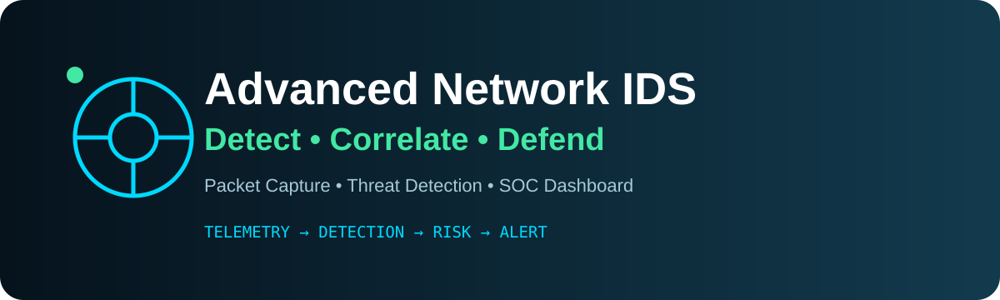
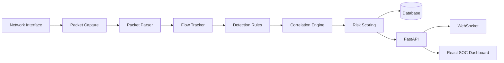

<div align="center">




[](https://www.python.org/)
[](https://fastapi.tiangolo.com/)
[](https://react.dev/)
[](https://scapy.net/)

### 🛰️ Network Visibility → Detection → Investigation

**A Python/FastAPI network intrusion detection and monitoring platform for SOC-style security workflows.**

</div>

---

## 🧠 Overview

Advanced Network IDS is designed for learning and authorized lab environments. It combines packet capture, flow tracking, detection rules, event correlation, risk scoring and a React security dashboard.

> **Project status:** Active development. Some production-oriented capabilities are still being hardened.

## ✨ Detection & SOC Capabilities

- 📡 Real-time packet capture and flow tracking with Scapy
- 🔎 Port-scan, brute-force, ARP-spoofing, DNS and traffic-anomaly detection
- 🧩 Event correlation and incident / attack-chain analysis
- 📊 Explainable 0–100 risk scoring
- 🎯 MITRE ATT&CK technique mapping
- 🔐 JWT authentication and role-based access control
- ⚡ FastAPI REST API + WebSocket event streaming
- 🖥️ React dashboard for alerts, incidents and network activity
- 🗄️ SQLite for local development / PostgreSQL for deployment

## ⚡ Architecture



## 🧰 Tech Stack

| Layer | Technology |
|---|---|
| Backend | Python 3.11+, FastAPI, SQLAlchemy, Scapy, Alembic |
| Frontend | React 18, TypeScript, Vite, Tailwind CSS, Recharts, Zustand, Axios |
| Database | SQLite / PostgreSQL |
| Security | JWT, RBAC, MITRE ATT&CK mapping |

## 🚀 Quick Start

### Backend

```bash
git clone https://github.com/wwwsahilchand123-maker/Advanced-Network-IDS.git
cd Advanced-Network-IDS/backend
python -m venv venv
```

Windows:
```bash
venv\Scripts\activate
```

```bash
pip install -r requirements.txt
uvicorn app.main:app --reload
```

### Frontend

```bash
cd ../frontend
npm install
npm run dev
```

API docs normally run at `http://localhost:8000/api/v1/docs` and the Vite frontend at `http://localhost:5173`.

## 🔍 Detection Modules

`Port Scan` · `Brute Force` · `ARP Spoofing` · `DNS Anomaly` · `Traffic Anomaly` · `Suspicious Traffic` · `Event Correlation`

Detection thresholds should be tuned to the monitored environment. Detection results are indicators and should be investigated before response actions.

## 🧪 Testing

```bash
cd backend
pytest
pytest --cov=app --cov-report=html
```

## 📁 Project Structure

```text
Advanced-Network-IDS/
├── backend/
│   ├── app/
│   │   ├── api/
│   │   ├── capture/
│   │   ├── correlation/
│   │   ├── detection/
│   │   ├── models/
│   │   ├── services/
│   │   └── main.py
│   ├── alembic/
│   └── requirements.txt
├── frontend/
├── detection_rules/
├── TESTING_GUIDE.md
├── .env.example
└── README.md
```

## 🔐 Security

Keep secrets in `.env`, use strong credentials, restrict CORS, and monitor only networks you own or are explicitly authorized to monitor.

## ⚠️ Disclaimer

This is a portfolio/educational IDS. Do not deploy it as a replacement for mature security platforms without independent validation and hardening. Use packet capture only on authorized networks.

---

<div align="center">

### 🛡️ DETECT THE SIGNAL · UNDERSTAND THE THREAT · DEFEND THE NETWORK

**Built by Sahil Chand**

</div>
